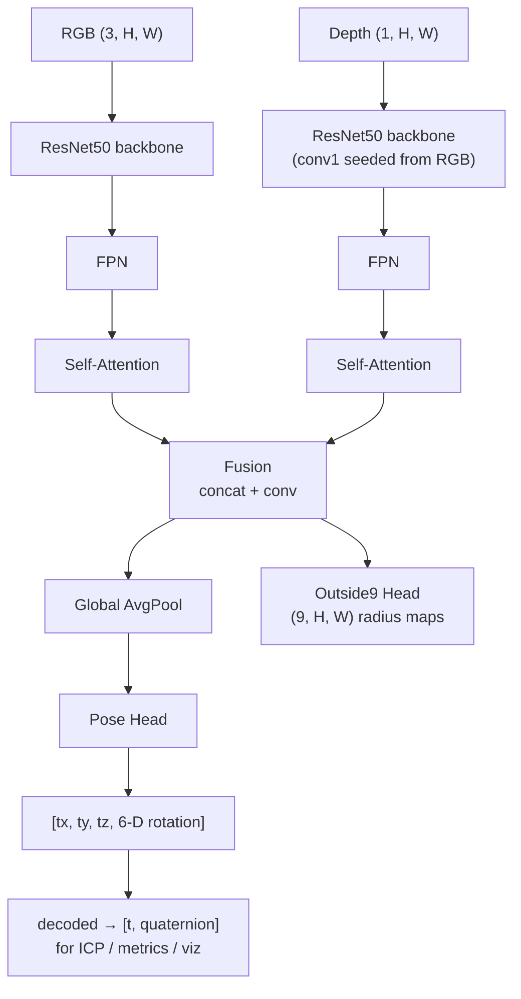
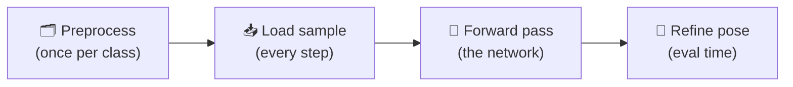

<div align="center">

# 🎯 Computer Vision for Robotics — 6D Object Pose Estimation (Detection, Pose Regression & ICP Refinement)

### RGB-D 6D object pose estimation on LINEMOD — dual-ResNet50 + FPN + attention, 6-D rotation head, and two-stage ICP refinement


</div>

<br>

> **TL;DR** — A complete, Colab-first pipeline for **6D object pose
> estimation** on the **LINEMOD** dataset. A dual-backbone RGB-D network
> (**EnhancedRCVPose**) regresses each object's full 3D rotation +
> translation from a fused RGB/depth feature representation, refined at
> inference time by swapping in a depth-measured translation and running
> two-stage ICP against the observed point cloud — alongside a **YOLOv8**
> detector for the 2D bounding boxes. Six notebooks take you from raw
> dataset zips to a trained, evaluated, visualized model, reaching
> **~98.8% ADD success**, **~2.2 cm** translation RMSE, and **~8.5°**
> rotation error across 13 LINEMOD classes.

<br>

## 📋 Contents

- [Results](#-results)
- [Architecture](#️-architecture--enhancedrcvpose)
- [Quick Start](#-quick-start-google-colab)
- [Training Strategy & Loss](#-training-strategy--loss)
- [Evaluation Pipeline](#-evaluation-pipeline)
- [Dataset](#️-dataset-linemod)
- [Pipeline Walkthrough](#-pipeline-walkthrough--what-actually-happens-to-the-data)
- [Key Engineering Decisions](#-key-engineering-decisions)
- [Repository Structure](#-repository-structure)
- [Configuration](#-configuration)
- [References](#-references)

<br>

## 🎯 Overview

<table>
<tr>
<td width="25%" valign="top"><b>🧩 Problem</b></td>
<td>6D object pose estimation — full 3D rotation + translation of known rigid objects from a single RGB-D frame</td>
</tr>
<tr>
<td valign="top"><b>📦 Data</b></td>
<td>LINEMOD — 13 texture-rich object classes, RGB + depth + masks + ground-truth poses + 3D meshes</td>
</tr>
<tr>
<td valign="top"><b>🧠 Model</b></td>
<td><b>EnhancedRCVPose</b> — dual-ResNet50 + FPN + attention, 6-D continuous rotation head, auxiliary radius-map supervision</td>
</tr>
<tr>
<td valign="top"><b>🔍 Detection</b></td>
<td>YOLOv8s, trained separately, for 2D bounding boxes feeding the pose network</td>
</tr>
<tr>
<td valign="top"><b>🎯 Refinement</b></td>
<td>Depth-measured translation swap + two-stage (point-to-point → point-to-plane) ICP against the observed point cloud</td>
</tr>
<tr>
<td valign="top"><b>📈 Result</b></td>
<td><b>~98.8% ADD success</b>, ~2.2 cm translation RMSE, ~8.5° rotation error (held-out validation split)</td>
</tr>
</table>

<br>

## 📊 Results

Validation set, 13 LINEMOD classes, held-out split never seen during training:

<table>
<tr><th align="left">Metric</th><th align="left">Mean</th><th align="left">What it means</th></tr>
<tr><td><b>Translation RMSE</b></td><td><b>~2.2 cm</b></td><td>3D position error</td></tr>
<tr><td><b>Rotation Error</b></td><td><b>~8.5°</b></td><td>geodesic angular error</td></tr>
<tr><td><b>ADD Success Rate</b></td><td><b>~98.8%</b></td><td>fraction of frames with a correct pose (ADD metric, per-class threshold)</td></tr>
</table>

> Most classes individually land translation error under 2 cm and rotation
> error under 8°; a couple of harder/larger objects (e.g. `benchvise`) run
> higher — see `05_evaluate.ipynb`'s per-class table for the full
> breakdown.

<br>

## 🏗️ Architecture — EnhancedRCVPose



<table>
<tr><td width="30%"><b>Dual ResNet50 backbone</b></td><td>Separate pretrained encoders for RGB and depth — depth <code>conv1</code> is initialised from the mean of the RGB <code>conv1</code> weights.</td></tr>
<tr><td><b>FPN + self-attention</b></td><td>Applied to each modality separately, fused by concatenation + conv.</td></tr>
<tr><td><b>Pose head → 9-D output</b></td><td>3 translation + a <b>6-D continuous rotation representation</b> (<a href="https://arxiv.org/abs/1812.07035">Zhou et al., 2019</a>) instead of a raw quaternion — quaternions have a discontinuity/double-cover ambiguity (<code>q</code> and <code>-q</code> are the same rotation) that's measurably harder to regress directly. Decoding 6-D → a proper rotation matrix via Gram-Schmidt avoids that. The loss compares rotations via the geodesic angle between matrices (<code>arccos((trace(Rᵀ·R_gt) − 1) / 2)</code>), the same angular quantity the earlier quaternion formula used, so the loss weight didn't need retuning when this changed.</td></tr>
<tr><td><b>Outside9 head</b></td><td>9 per-pixel radius maps (distance from each pixel to one of 9 FPS-sampled 3D keypoints), trained as auxiliary supervision.</td></tr>
</table>

<br>

## 🚀 Quick Start (Google Colab)

Run the notebooks **in order**, in the same Colab session/runtime:

<table>
<tr><th align="left">Step</th><th align="left">Notebook</th><th align="left">What it does</th></tr>
<tr><td>1</td><td><code>01_setup.ipynb</code></td><td>Mount Drive, install packages, verify GPU, write <code>config.json</code>, clone this repo</td></tr>
<tr><td>2</td><td><code>02_preprocess.ipynb</code></td><td>Extract + preprocess each class end-to-end (poses, keypoints, splits)</td></tr>
<tr><td>3</td><td><code>03_yolo_train.ipynb</code></td><td>Train YOLOv8s for 2D object detection</td></tr>
<tr><td>4</td><td><code>04_pose_train.ipynb</code></td><td>Train EnhancedRCVPose — frozen warm-up → full fine-tune → rotation fine-tune</td></tr>
<tr><td>5</td><td><code>05_evaluate.ipynb</code></td><td>Validation + held-out test metrics (Translation RMSE, Rotation Error, ADD)</td></tr>
<tr><td>6</td><td><code>06_visualize.ipynb</code></td><td>Pose wireframe overlays, YOLO detections, radius-map heatmaps</td></tr>
</table>

> Every notebook reads `/content/config.json` (written by `01_setup.ipynb`)
> — no paths are hardcoded or copy-pasted between notebooks.

<details>
<summary><b>Local / non-Colab setup</b></summary>
<br>

```bash
pip install torch torchvision torchaudio --index-url https://download.pytorch.org/whl/cu118
pip install -r requirements.txt
```

The notebooks assume Colab-style paths (`/content/...`) and Google Drive
mounting; adapt `01_setup.ipynb`'s config cell if running elsewhere.

</details>

<br>

## 📉 Training Strategy & Loss

**Three stages** (`04_pose_train.ipynb`):

<table>
<tr><th align="left">Stage</th><th align="left">Epochs</th><th align="left">Backbone</th><th align="left">LR schedule</th><th align="left">Notes</th></tr>
<tr><td>1 — Warm-up</td><td>15</td><td>frozen</td><td><code>OneCycleLR</code>, peak <code>1e-3</code></td><td>Only <code>pose_head</code>/<code>outside9_head</code> train; BatchNorm frozen too</td></tr>
<tr><td>2 — Full fine-tune</td><td>up to 65</td><td>unfrozen</td><td>fresh <code>OneCycleLR</code>, peak <code>3e-4</code></td><td>Early stopping, <code>patience=15</code></td></tr>
<tr><td>3 — Rotation fine-tune</td><td>10</td><td>frozen again</td><td><code>CosineAnnealingLR</code>, <code>1e-4</code></td><td>Same rotation weight as main training</td></tr>
</table>

`WeightedPoseLoss`:

```
L = W_TRANS · L_trans + W_ROT · L_rot + W_PTS · L_pts        (1.0, 10.0, 1.0)
```

- `L_trans` — MSE on `[tx, ty, tz]`
- `L_rot` — geodesic angle between the predicted (6-D-decoded) and ground-truth rotation matrices
- `L_pts` — MSE on the 9 predicted radius maps

> Gradient accumulation, AMP (`autocast` + `GradScaler`), `pin_memory`, and
> `persistent_workers` are used throughout; batch size / worker count
> auto-scale to the detected GPU (H100/A100/T4).

<br>

## 📐 Evaluation Pipeline

`05_evaluate.ipynb`, per sample:

1. Run the network → decode the 9-D output to `[t, quaternion]`.
2. Replace `t` with the depth+mask centroid translation guess (see [Key Engineering Decisions](#-key-engineering-decisions)).
3. Refine `[t, quaternion]` with two-stage ICP against the observed depth point cloud.
4. Score against ground truth: Translation RMSE, Rotation Error, Points MSE, ADD, ADD Success %.

> ADD success uses **per-class thresholds** (`config.json`'s
> `ADD_THRESHOLDS`, standard LINEMOD benchmark values) and mesh points
> loaded unscaled (matching this project's original reference
> implementation), so results are directly comparable across runs.

<br>

## 🗃️ Dataset: LINEMOD

13 classes (2 of the standard 15 are excluded — texture-poor/ambiguous geometry):

`ape` · `benchvise` · `cam` · `can` · `cat` · `driller` · `duck` · `eggbox` · `glue` · `holepuncher` · `iron` · `lamp` · `phone`

> **Split per class** (`02_preprocess.ipynb`, deterministic per-class
> seed) — **70% train / 20% val / 10% test**; test is held out and should
> only be scored once at the end.

<details>
<summary><b>Per-class layout after preprocessing</b></summary>
<br>

<table>
<tr><td><code>rgb/</code></td><td>RGB images (<code>.png</code>)</td></tr>
<tr><td><code>depth/</code></td><td>Depth images (<code>.dpt</code> — binary uint16, millimetres)</td></tr>
<tr><td><code>pose/</code></td><td>Ground-truth <code>[R|t]</code> matrices (<code>.npy</code>, 3×4), translation in metres</td></tr>
<tr><td><code>mask/</code></td><td>Object masks (<code>.png</code>)</td></tr>
<tr><td><code>mesh.ply</code></td><td>3D model — ADD metric + visualization</td></tr>
<tr><td><code>Outside9.npy</code></td><td>9 FPS-sampled 3D keypoints (mm) — radius maps derived from these on-the-fly</td></tr>
<tr><td><code>Split/</code></td><td><code>train.txt</code> / <code>val.txt</code> / <code>test.txt</code></td></tr>
<tr><td><code>gt.yml</code></td><td>Original ground-truth (kept for reference; not read after preprocessing)</td></tr>
</table>

</details>

<br>

## 🔄 Pipeline Walkthrough — what actually happens to the data



<details>
<summary><b>A. Once per object class</b> — <code>02_preprocess.ipynb</code></summary>
<br>

<table>
<tr><th align="left">Step</th><th align="left">What happens</th></tr>
<tr><td>1. Extract</td><td>Pull that class's RGB, depth, masks, and <code>gt.yml</code> (ground truth) from the Drive zip</td></tr>
<tr><td>2. Copy 3D model</td><td><code>mesh.ply</code> for that object</td></tr>
<tr><td>3. <b>Farthest-Point Sampling</b></td><td>On the <b>3D mesh itself</b> — starting from a random vertex, repeatedly pick whichever vertex is farthest (in 3D) from every point chosen so far, 9 times → <code>Outside9.npy</code>. Maximally-spread keypoints give the strongest, least-ambiguous geometric constraints later (radius maps, ICP). Runs <b>once per object</b>, on the mesh — not per image</td></tr>
<tr><td>4. Extract poses</td><td>Ground-truth <code>(R, t)</code> for every frame, from <code>gt.yml</code></td></tr>
<tr><td>5. Rename · convert · split</td><td>6-digit IDs, depth PNG → binary <code>.dpt</code>, 70/20/10 train-val-test split</td></tr>
<tr><td>6. Normalise</td><td>mm → m, sanity-check every file</td></tr>
</table>

</details>

<details>
<summary><b>B. Every time a sample is loaded</b> — <code>PoseDataset</code>, train <i>and</i> eval</summary>
<br>

<table>
<tr><th align="left">Step</th><th align="left">What happens</th></tr>
<tr><td>1. Load</td><td>That frame's RGB, depth, mask, and ground-truth pose</td></tr>
<tr><td>2. <b>Mask the depth</b></td><td>Pixels outside the object's silhouette are zeroed out, so only real object geometry feeds anything downstream (radius maps here, the translation guess at eval time)</td></tr>
<tr><td>3. <b>Radius maps, on-the-fly</b></td><td>For each of the 9 mesh keypoints, and every masked-in pixel: back-project the pixel to 3D using its depth + camera intrinsics, then measure its distance to the keypoint → 9 dense per-pixel maps, matching the frame's resolution. This is <code>outside9_head</code>'s training target</td></tr>
<tr><td>4. Augment <i>(train only)</i></td><td>Colour jitter + depth noise, then ImageNet-normalise RGB</td></tr>
</table>

</details>

<details>
<summary><b>C. Forward pass through the network</b> — <code>EnhancedRCVPose</code></summary>
<br>

<table>
<tr><th align="left">Step</th><th align="left">What happens</th></tr>
<tr><td>1. RGB branch</td><td>ResNet50 → FPN → self-attention</td></tr>
<tr><td>2. Depth branch</td><td>A <b>separate</b> ResNet50 → FPN → self-attention (<code>conv1</code> seeded from the RGB backbone's, channel-averaged)</td></tr>
<tr><td>3. Fuse</td><td>Concatenate both attended feature maps + conv</td></tr>
<tr><td>4. Two heads</td><td>Fused features <b>pooled</b> → <code>pose_head</code> → 9-D <code>[t, 6-D rotation]</code> · fused features <b>un-pooled</b> → <code>outside9_head</code> → 9 radius maps, upsampled to input resolution</td></tr>
</table>

</details>

<details>
<summary><b>D. Raw prediction → final pose</b> — <code>05_evaluate.ipynb</code> / <code>06_visualize.ipynb</code></summary>
<br>

<table>
<tr><th align="left">Step</th><th align="left">What happens</th></tr>
<tr><td>1. Decode</td><td>9-D output → <code>[t, quaternion]</code> (Gram-Schmidt on the 6-D part → rotation matrix → quaternion)</td></tr>
<tr><td>2. <b>Replace translation</b></td><td>Swap in the measured centroid of the masked depth points from step B.2 — the network's own translation is its weakest output, so a direct geometric measurement replaces it</td></tr>
<tr><td>3. <b>Two-stage ICP</b></td><td>Coarse point-to-point pass, then a finer point-to-plane pass seeded by the coarse result, against the full observed depth point cloud</td></tr>
<tr><td>4. Score</td><td>Final <code>[t, quaternion]</code> vs. ground truth → Translation RMSE, Rotation Error, ADD</td></tr>
</table>

</details>

<br>

## 🔬 Key Engineering Decisions

A few points worth knowing before reading the notebooks — these came out of
debugging real accuracy problems, not just architecture choices made up front.

<details>
<summary><b>Radius maps are computed on-the-fly, never stored to disk</b></summary>
<br>

Earlier versions of this pipeline precomputed 9 folders per class
(`Out_pt1_dm` … `Out_pt9_dm`), one `.npy` file *per training image per
keypoint*. That's a 9× multiplier on top of the already large LINEMOD
dataset — far too much to fit on a Colab session's local disk, let alone
transfer from Drive. `PoseDataset` (`src/dataset.py`) now computes all 9
radius maps **at load time**, directly from `depth` + `mask` + `pose` +
`Outside9.npy` (just 9 keypoint coordinates, not thousands of files), using
a `numba`-JIT-compiled kernel run in parallel across `DataLoader` workers.
Local disk per class now stays close to the raw sensor data size, and
`02_preprocess.ipynb` actively deletes any leftover `Out_pt*_dm/` folders
from older runs.

</details>

<details>
<summary><b>The regressed translation is replaced with a depth-measured one before ICP</b></summary>
<br>

The pose head's translation is regressed from a single globally-pooled
feature vector — it never sees *where* in the frame the object actually
is, which made it the weakest part of the raw prediction (~10 cm error).
Before ICP refinement, `05_evaluate.ipynb` instead computes the centroid of
the real, depth-sensor-measured 3D points inside the object's mask and
uses that as the translation starting point (keeping the network's
predicted rotation). This alone cut Translation RMSE by roughly 4–5×,
since it replaces a hard image-regression problem with a direct geometric
measurement.

</details>

<details>
<summary><b>Two-stage ICP refinement</b></summary>
<br>

`refine_icp()` runs a coarse point-to-point pass (loose correspondence
threshold, to capture large initial offsets) followed by a finer
point-to-plane pass (tight threshold, seeded by the coarse result) against
the observed depth point cloud — more accurate than a single
point-to-point pass alone, and the network's output is treated throughout
as an *initial guess*, never scored directly.

</details>

<details>
<summary><b>In-plane rotation augmentation was removed, not fixed</b></summary>
<br>

An earlier version rotated the RGB/depth/mask images for training
augmentation but never rotated the corresponding pose/radius-map targets
to match, silently injecting up to ±10° of label noise into every
augmented sample. Computing the correct compensating rotation is a real
fix but risks a sign/convention error that's hard to catch without live
testing; removing the rotation step (color jitter + depth noise remain) is
the safer trade — it costs a small amount of augmentation diversity in
exchange for zero risk of a *new*, harder-to-detect bug.

</details>

<br>

## 📁 Repository Structure

```
.
├── 01_setup.ipynb          # Env setup, Drive mount, GPU check, config.json, repo clone
├── 02_preprocess.ipynb     # Per-class extraction, poses, keypoints, splits
├── 03_yolo_train.ipynb     # YOLOv8s detection training
├── 04_pose_train.ipynb     # EnhancedRCVPose training (3 stages)
├── 05_evaluate.ipynb       # Validation + test metrics
├── 06_visualize.ipynb      # Pose overlays, YOLO detections, radius-map heatmaps
├── src/
│   ├── model.py             # EnhancedRCVPose, WeightedPoseLoss, 6-D rotation helpers
│   └── dataset.py           # PoseDataset (on-the-fly radius maps), augmentation, safe_collate
├── requirements.txt
└── README.md
```

<br>

## 🔧 Configuration

All paths and shared settings live in `/content/config.json`, written by
`01_setup.ipynb` and extended by later notebooks (`YOLO_MODEL_PATH`,
`BEST_POSE_MODEL`, …) as they produce artifacts:

```json
{
  "DATA_DIR": "/content/dataset/linemod/Linemod_preprocessed/data",
  "YOLO_DIR": "/content/dataset/linemod/Linemod_ready",
  "DRIVE_MODELS": "/content/drive/MyDrive/models",
  "REPO_DIR": "/content/6D-pose-estimation",
  "ALL_CLASSES": ["01","02","04","05","06","08","09","10","11","12","13","14","15"],
  "CLASS_NAMES": ["ape","benchvise","cam","can","cat","driller","duck","eggbox","glue","holepuncher","iron","lamp","phone"],
  "CAMERA_K": [[572.4114, 0, 325.2611], [0, 573.57043, 242.04899], [0, 0, 1]],
  "ADD_THRESHOLDS": {"01": 0.01421, "02": 0.03309, "...": "..."},
  "YOLO_MODEL_PATH": "...Drive.../yolo_best.pt",
  "BEST_POSE_MODEL": "...Drive.../best_rcvpose_<timestamp>_finetuned.pth"
}
```

> Re-running `01_setup.ipynb`'s config cell **merges** with any existing
> `config.json` rather than overwriting it, so keys added later by other
> notebooks survive; `05_evaluate.ipynb` and `06_visualize.ipynb`
> additionally auto-detect the newest checkpoint on Drive if
> `BEST_POSE_MODEL` is ever missing, instead of failing to load a model.

<br>

## 📚 References

- **RCVPose** — Xu et al., *RCVPose: Recovery of 3D Pose from Radial Correspondences*
- **6-D rotation representation** — Zhou et al., *On the Continuity of Rotation Representations in Neural Networks* ([arXiv:1812.07035](https://arxiv.org/abs/1812.07035))
- **LINEMOD dataset** — Hinterstoisser et al., *Model Based Training, Detection and Pose Estimation of Texture-Less 3D Objects in Heavily Cluttered Scenes*
- **ADD metric** — Xiang et al., *PoseCNN: A Convolutional Neural Network for 6D Object Pose Estimation in Cluttered Scenes*
- **YOLOv8** — [Ultralytics](https://github.com/ultralytics/ultralytics)

<br>

## 🛠️ Tech Stack


<br>

---

<div align="center">
<sub>6D object pose estimation on LINEMOD — EnhancedRCVPose (dual-ResNet50 + FPN + attention) with YOLOv8 detection and ICP refinement.</sub>
</div>

